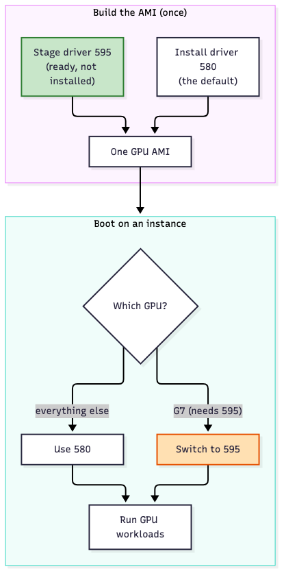
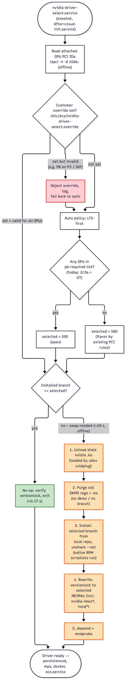

# Dynamic NVIDIA Driver Version Selection (LTS + Production Branch) for AL2023 ECS GPU AMIs

**[Status: DRAFT — for team review. Option A is built end-to-end into the Packer recipe (`make al2023gpu`). The hardened recipe (gpgcheck on, 580 fallback, interrupted-swap recovery, EBS prefetch) was rebuilt as `ami-0c7256dba826427c1` and validated on real G7 hardware on 2026-09-30: automatic 595 selection with no override or customer config, plus failure injection (corrupted RPM, power cut mid-swap, full disk). Earlier POC on an L4 (G6) stand-in; forward swap and 580 also validated on real G7/G7e.]**

## TL;DR

- **Problem.** The AMI pins one NVIDIA driver (R580). G7 (`2c3a`) is not qualified on R580: NVIDIA does not list it, and AWS documents 595 or later. P3/P3dn/G3 are legacy in R595, so moving everything to R595 is not an option either. One AMI must carry both branches. There is also customer pressure to *offer* 595 even where 580 works, because scanners flag 580 hosts for CVEs that are already fixed on R580 — false warnings, not a real exposure (see drawback 7).
- **Recommendation: Option A.** Keep today's native 580 install unchanged for every family. Stage an offline 595 package set in the AMI, and swap it in at boot **only** on hardware that needs PB (today only G7).
- **Cost.**
  - G7 pays a one-time swap on first boot, before `ecs.service`: **37.4 s** on a fresh instance from the hardened recipe AMI (measured on real G7, 2026-09-30). Almost all of it is the first read of a volume that EBS restores lazily from the AMI snapshot. The swap was 75.3 s before an EBS prefetch was added, and 18–20 s on an already-read volume (the POC figure);
  - later boots on G7 take the no-op path: **1.4 s** on real G7, including the 595 module load;
  - every other family runs only the selector's no-op check: **0.08–0.17 s**, with the same driver, flavor and load path as today;
  - disk is **0.3–0.65 GiB**;
  - the rpmdb stays truthful, and release detection is unchanged.
- **Validated.**
  - **The production recipe end-to-end (2026-09-29, re-validated 2026-09-30 on the hardened build):** an AMI baked by `make al2023gpu` with the integrated `stage-nvidia-pb.sh` auto-selected 595 on a real G7 at boot, with **no override and no customer configuration**. This is the design's headline success criterion, now shown on hardware;
  - **Failure injection (2026-09-30):**
    - a corrupted staged RPM, a full disk and a failed 595 module load each ended on a working 580;
    - a hard power cut in the middle of the swap was repaired on the next boot, ending on 595 with `dnf check` and `rpm -Va` clean;
    - the G7 `lts` override is accepted with an "unqualified" warning, and the `pb` override is rejected on P3 and G6f (see [Hardened recipe and failure injection](#hardened-recipe-and-failure-injection-2026-09-30));
  - the swap on L4 (stand-in) and, via a forced override, on real G7 in the earlier POC;
  - 580 on G7 and G7e;
  - 595 GRID on G6f.

  580 working on G7 is unqualified, so it is used only as a **degraded fallback**.
- **Decisions needed from reviewers:**
  1. Option A vs B (EKS parity) vs C (separate AMI);
  2. whether to stage the reverse 580 set for stop/start away from G7 (+328 MiB);
  3. the customer-override surface.

  The Phase 0 boot-path defect fixes are proposed as a separate change that can ship first.

## Metadata

| | |
|---|---|
| Doc owner | Dhruv Saran |
| Related work | EKS "LTS and PB NVIDIA Driver Versions in Single EKS AMI" (amazon-eks-ami PR #2819, shipped v20260917) |
| POC evidence | `docs/design/poc/` (prototype code + data), raw logs in `docs/design/poc/raw/` (see [Artifacts](#artifacts)) |

## Decision Log

| Date | Decision | Status |
|---|---|---|
| 2026-09-28 | The released flavor-selection design (proprietary / open / GRID at **one** driver version) is the foundation; this project adds **version** selection on top of it and must not regress flavor selection. | Proposed |
| 2026-09-28 | Default policy is **LTS-first**: every instance runs the LTS branch (R580) unless the LTS branch cannot drive an attached GPU. Today that is only G7. | Proposed |
| 2026-09-28 | Recommended mechanism: **native LTS install + offline, pre-staged PB package set swapped in at boot only on PB-required hardware** (Option A). EKS-style co-resident trees + overlays (Option B) and a separate AMI per branch (Option C) are the documented alternatives. | Proposed — needs review |
| 2026-09-28 | The PB tree carries **only the open kernel-module flavor**. P3/P3dn/G3 (proprietary-only) and G6f/Gr6f (GRID flavor) are hard-pinned to LTS. | Proposed |
| 2026-09-28 | A **customer-facing runtime override is required**, not optional: a customer must be able to force a driver branch at launch (via a boot-time config surface, not a Packer build variable). Automatic selection is the default; the override takes precedence when set. An override that is **incompatible** with an attached GPU is **rejected and logged**, and selection falls back to the automatic (safe) choice. The remaining open question is *which* config surface, not *whether* to offer one. | Proposed |
| 2026-09-28 | Fix the pre-existing boot-path defects found in the POC (nvidia-kmod-load fails on every reboot, wasted dracut runs, flavor split-brain across instance-type changes) as a **separate, earlier change** (Phase 0). | Proposed |
| 2026-09-28 | G7 hardware validation is **blocked** by `InsufficientInstanceCapacity` for g7.2xlarge / g7e.2xlarge in all four us-west-2 AZs. Launch is gated on completing it. | Superseded 2026-09-29 |
| 2026-09-29 | G7/G7e validated on Spot hardware: 580 works on both (unqualified on G7), and the forced Option A 580 → 595 swap works on G7 (19.2 s). The hardware launch gate is met for the forward path; the reverse swap on G7 remains a ToD item. See [validation](#g7--g7e-hardware-validation-2026-09-29-previously-blocked). | Done |
| 2026-09-29 | **GRID 20.2 (595) works on G6f** (measured on g6f.large: Licensed, CUDA PASS, survives a reboot). It is not yet in the EC2 docs, and Gr6f was not tested. G6f stays on LTS 580 GRID under LTS-first. The reason is now "not needed, and PB carries no GRID flavor", not "595 is incompatible". | Done |
| 2026-09-29 | **580 is an acceptable degraded fallback on G7.** PB (595) stays the default. If the PB swap fails, the unit falls back to 580. A customer `lts` override on G7 is accepted instead of rejected. Both cases log a warning that the configuration is unqualified. The mechanism is a reviewed `lts-fallback.devices` list (today only `2c3a`). | Proposed |
| 2026-09-29 | **Option A is integrated into the Packer recipe and validated end-to-end on real G7 — the automatic path, not a forced override.** `make al2023gpu` now bakes `stage-nvidia-pb.sh` (build the 595 open kmod, package `kmod-nvidia-open-prebuilt`, stage both version sets + repo metadata + device lists, install the boot units) on top of the unchanged native 580 install. An AMI built this way, launched on a g7.2xlarge (`2c3a`), **auto-detected the device and swapped to 595 at boot with no override** and no customer config; `nvidia-smi`=595.91.07, `dnf check` clean, a CUDA 13.2 container enumerated the GPU. This supersedes the forced-override G7 result above: the recipe does it automatically. Evidence: `docs/design/poc/raw/g7-595-validation-20260929.log`. | Done |
| 2026-09-30 | **Recipe hardened to match what this doc describes, and failure-injected on real G7.** Four behaviors the doc described but the 2026-09-29 selector did not implement were added:<br>• gpgcheck=1 on the AL/NVIDIA-signed RPMs, with a build-time `rpm -K` gate and sha256 verification of the local kmod RPM;<br>• the `lts-fallback.devices` list (the G7 `lts` override, and 580 fallback when the 595 swap or load fails);<br>• `pb` override rejection on G6f/Gr6f vGPU guests (by subsystem ID);<br>• recovery from a swap interrupted mid-transaction.<br>The 75.3 s cold first-boot swap was traced to lazy EBS snapshot loading; a parallel prefetch cut it to 37.4 s on real G7. Evidence: `docs/design/poc/raw/p3-hardening-20260930/`. | Done |

---

## Background / Introduction

### Evolution of the NVIDIA driver strategy in ECS GPU AMIs

1. **Legacy (proprietary only).** `kmod-nvidia-latest-dkms` from the Amazon Linux repo. Broad legacy hardware support, but it doesn't support Grace Hopper / Blackwell.
2. **Open kernel modules.** `kmod-nvidia-open-dkms`. This supports modern architectures but drops P3 (V100) / G3 (M60).
3. **Dynamic flavor selection (released, Harish's design).** All three kernel-module flavors are built at build time with DKMS at **one pinned driver version** (today `580.178.04`, `NVIDIA_DRIVER_VERSION:15`) and archived to `/var/lib/dkms-archive/{nvidia,nvidia-proprietary,nvidia-grid}`. At boot, `nvidia-kmod-load.sh` picks the flavor from PCI IDs:
   - GRID for G6f/Gr6f;
   - proprietary for P3/P3dn/G3;
   - open for everything else.

   `nvidia*`, `kmod*`, `libnvidia*` and `kernel*` are versionlocked.
4. **This project: dynamic version selection.** NVIDIA now ships hardware that the pinned branch **cannot drive**. At the same time, some hardware we still sell **cannot run the newer branch**. A single pinned version can no longer serve the whole GPU fleet.

### Why one version no longer works

NVIDIA publishes three kinds of driver branch:
- **LTSB** (Long-Term Support Branch; R580, supported until June 2028);
- **PB** (Production Branch; R595, supported until March 2027);
- **NFB** (New Feature Branch; R590, R610, R615, short-lived).

The AL2023 NVIDIA repo mirrors only 570, 580 and 595. The POC measured this with `dnf repoquery` on the current AMI; no 590, 610 or 615 is present.

**The problem is caught between two hardware constraints:**

- **G7 (RTX PRO 4500 Blackwell Server Edition, PCI `10de:2c3a`) is absent from every repo-published R580 `supported-gpus.json`.** It first appears in `595.58.03`, and AWS documents G7 as requiring "595 or later".
- **P3/P3dn (V100) and G3 (M60) are `legacybranch: 580.xx` in every 590+ `supported-gpus.json`.** R580 is the last branch that supports Maxwell/Pascal/Volta, so moving the whole AMI to 595 would drop them.
- **G6f/Gr6f vGPU guests need a GRID driver.** EC2 documents "GRID 18.4 to GRID 19.5". This was earlier read to mean that a GRID 20.x (R595) guest is incompatible with the G6f hosts. That is **no longer true for G6f**: GRID 20.2 (595.91.07) was measured working and Licensed on g6f.large on 2026-09-29 (see [G6f on GRID 20](#g6f-on-grid-20-2026-09-29)). The EC2 docs have not been updated yet, and Gr6f was not tested.

Beyond the hardware constraints, there is a **customer-facing security-reporting pressure to offer 595 even where 580 works**. Customers running the LTS-pinned AMI file complaints that their scanners flag the 580 driver as having unpatched CVEs, when in fact the fixes are present on the R580 branch — the warnings are an artifact of how the advisories are published, not a real exposure (details in [Security Considerations](#security-considerations) and drawback 7). The mismatch is concrete: ALAS2023NVIDIA-2026-283/285/286/287/289/292/293 list their CVEs as fixed only in `595.71.05`, so any tool keyed on the ALAS "fixed-in" version reports every 580 host as vulnerable, even though NVIDIA's bulletin 5821 shows those same CVEs fixed on the R580 branch at `580.159.03`. Being able to run 595 on demand — and, longer term, per-branch advisories — gives these customers a way to clear the noise without abandoning the LTS branch on the rest of the fleet. This is a motivation for carrying both branches (and for a customer override), not a claim that 580 is actually unpatched.

The AMI therefore has to carry **both** R580 and R595 and choose between them per instance. EKS reached the same conclusion and shipped a two-branch AMI in v20260917.

### Hardware compatibility matrix (x86_64 families in scope)

Sources: `supported-gpus.json` extracted from 580.x / 590.x / 595.x packages, AWS EC2 driver documentation, and NVIDIA vGPU release notes. PCI IDs other than L4 (`27b8`, measured with `lspci` on g6.xlarge) are mapped by product name.

| Family | GPU (arch) | PCI device | 580 open | 580 prop. | 595 open | 595 prop. | GRID | **Proposed (branch / flavor)** |
|---|---|---|---|---|---|---|---|---|
| G3 | M60 (Maxwell) | 13F2 | no | yes | legacy | legacy | — | **580 / proprietary** (dead end at R580 EOL, Jun 2028) |
| P3 / P3dn | V100 (Volta) | 1DB1 / 1DB5 | no | yes | legacy | legacy | — | **580 / proprietary** (dead end) |
| G4dn | T4 (Turing) | 1EB8 | yes | yes | yes | yes | — | 580 / open |
| G5 | A10G (Ampere) | 2237 | yes | yes | yes | yes | — | 580 / open |
| G6 / Gr6 | L4 (Ada) | 27B8 | yes | yes | yes | yes | — | 580 / open |
| G6f / Gr6f | L4 vGPU (27b8:1733/1735/1737) | 27B8 | n/a | n/a | n/a | n/a | **GRID 19** (documented); GRID 20.2 works on G6f (measured, not documented) | **580 / GRID** |
| G6e | L40S (Ada) | 26B9 | yes | yes | yes | yes | — | 580 / open |
| **G7** | **RTX PRO 4500 BSE (Blackwell)** | **2C3A** | **not listed** | no | **yes (595.58.03+)** | no | — | **595 / open** |
| G7e | RTX PRO 6000 BSE (Blackwell) | 2BB5 | yes | no | yes | no | — | 580 / open |
| P4d / P4de | A100 (Ampere) | 20B0 / 20B2 | yes | yes | yes | yes | — | 580 / open |
| P5 / P5e / P5en | H100 / H200 (Hopper) | 2330 / 2335 | yes | yes | yes | yes | — | 580 / open |
| P6-B200 | B200 (Blackwell) | 2901 | yes | no | yes | no | — | 580 / open |
| P6-B300 | B300 (Blackwell Ultra) | 3182 | yes (580.82.07+) | no | yes | no | — | 580 / open |

Takeaways:
- **Only G7 needs the PB branch today.** Blackwell is open-only in every branch, so the PB branch needs **only the open flavor**. It needs neither proprietary (whose only users are legacy GPUs) nor GRID (whose only users, G6f/Gr6f, are documented for GRID 19 and are served by LTS).
- **CUDA compatibility.** 580 ships CUDA 13.0 and 595 ships CUDA 13.2. CUDA 13.x applications run on R580 through minor-version compatibility. The POC measured this on L4 with 580.178.04:
  - a CUDA **13.2** container (`nvidia/cuda:13.2.1-devel`) compiled and ran a vectorAdd kernel correctly both as SASS (`sm_89`) and as PTX JIT (`compute_89`);
  - the logs are `cuda-g6-580open-cuda132.log`.

  So LTS-first does not strand customers on newer CUDA minors. Features that require a newer driver still do.

### Glossary

- **LTSB / PB / NFB**: NVIDIA Long-Term Support, Production and New Feature driver branches.
- **Flavor**: the kernel-module variant, one of open (`nvidia`), proprietary (`nvidia-proprietary`) or GRID (`nvidia-grid`). The released design selects a flavor.
- **Branch / version**: R580 (`580.178.04`) or R595 (`595.91.07`). This design selects a branch.
- **Version-specific set**: the 18 RPMs whose NEVRA differs between 580 and 595:
  - 16 runtime packages (`nvidia-driver*`, `libnvidia-*`, `nvidia-kmod-common`, `nvidia-persistenced`, `nvidia-fabricmanager`, `nvidia-settings`, `nvidia-modprobe`, `nvidia-libXNVCtrl`, `xorg-x11-nvidia`, `egl-wayland{,2}`);
  - `kmod-nvidia-open-dkms`;
  - `kmod-nvidia-latest-dkms`.

  This was measured with real `dnf install --downloadonly` closures on the CI builder type.
- **DKMS / dracut**: Dynamic Kernel Module Support, and the initramfs generator that DKMS runs after every transaction.
- **rpm `--justdb`**: registers packages in the rpm database without installing their files. EKS uses it for files it unpacks by hand.
- **Overlay mount**: an overlayfs layered over `/usr/bin`, `/usr/lib64` and `/usr/share` (the EKS mechanism).

---

## Statement of Scope

**In scope**
- Selecting the NVIDIA driver **branch** (LTS R580 vs PB R595) per instance for ECS AL2023 GPU-optimized AMIs (x86_64), composed with the existing flavor selection.
- Build-time changes to carry the PB payload. Boot-time selection. **Release-pipeline changes to track two driver versions independently** — today the nightly automation detects, security-gates, pins, tags and publishes exactly *one* NVIDIA version (the LTS pin); with two branches in the AMI, it must do all of that for the PB branch as well, and expose both versions to customers. See [Release-pipeline changes](#release-pipeline-changes) for the specifics.
- Correctness across reboots and across stop/start instance-type changes.
- A **customer-facing branch override** at launch (required; see [Resolution policy](#resolution-policy)).
- All regions where the AL2023 GPU AMI ships today, including the GRID-skip regions (`eusc-de-east-1`, `eu-isoe-west-1`) and the air-gapped regions. **Selection must be fully offline.**

**Out of scope**
- AL2 GPU AMIs (end of life June 30, 2026).
- arm64 GPU families (G5g, P6e-GB200/GB300); ECS has no AL2023 arm64 GPU AMI.
- Changing the flavor-selection rules (e.g. EKS's "G4dn/G5 → proprietary with GSP off"). This is tracked as an open question.

**Future scope**
- Automatically generating and validating the PCI device lists from each shipped version's `supported-gpus.json` in CI (partially prototyped: `gen-device-lists.py`).
- Additional override surfaces beyond the cloud-config file, such as an IMDS tag or SSM parameter (see open question 3).
- Moving the PB branch forward (R595 → next PB), and folding G7 into the next LTSB when one lists `2c3a`.

## Project Success Criteria

1. A single AL2023 ECS GPU AMI, published at the existing SSM path, boots with a working driver on **every** in-scope family, **including G7**, with **no customer configuration**.
2. Every family except G7 keeps today's behavior: the same branch (580), the same flavor and the same boot path, with no added boot latency beyond noise.
3. Selection works **offline** and is **idempotent** across reboots and stop/start instance-type changes.
4. `ecs-init` GPU discovery succeeds, and the agent registers `ecs.capability.gpu-driver-version=<selected version>`.
5. A **customer-facing runtime override** lets a customer force a specific driver branch at launch. When the override is compatible with the attached GPU it takes precedence over automatic selection; when it is incompatible it is rejected, logged, and selection falls back to the automatic choice — the instance never boots a driver the GPU can't run.
6. The release pipeline detects, gates and publishes updates for **both** branches independently. Release notes list both versions.
7. A clear, documented stance on the version-locking / security-update / in-place-upgrade tradeoffs (see [Drawbacks](#drawbacks-of-the-recommended-solution) and [Security Considerations](#security-considerations)).
8. MACIS covers per-branch and per-flavor selection, the override (including the invalid-override rejection), plus a reboot-idempotency test.

---

## How the released system works today (the "before")

**Build (`al2023.pkr.hcl:201-240`, `install-nvidia-driver.sh`).** The builder is a GPU-less c5.4xlarge with a 30 GB root.
1. Install kernel-devel/headers/modules-extra for the running kernel, plus `dkms`. `versionlock 'kernel*'`.
2. Read the single pin from `/tmp/NVIDIA_DRIVER_VERSION`.
3. Build and archive the kernel modules:
   - **GRID** from the EC2 S3 runfile (`nvidia-installer --dkms --kernel-module-type open`), renamed to `nvidia-grid`;
   - **proprietary** (`kmod-nvidia-latest-dkms`), renamed to `nvidia-proprietary`;
   - **open** (`kmod-nvidia-open-dkms`), which keeps the name `nvidia`.

   Each is `dkms build/install` → `kmod-util archive` → `kmod-util remove`.
4. `dnf install` the userspace at exactly the pinned version. `versionlock 'nvidia*' 'kmod*' 'libnvidia*' 'xorg*'`.
5. Install and enable `nvidia-kmod-load`, `set-nvidia-clocks`, `nvidia-mps`, `nvidia-fabricmanager` and `nvidia-persistenced`.

**Measured on a faithful replica** (two fresh c5.4xlarge instances from the same stock AL2023 minimal source AMI; archive sizes within 3 KB of the released AMI):
- `install-nvidia-driver.sh` takes **431 s**: GRID 115 s, proprietary 119 s, open 94 s, userspace 50 s.
- dracut runs **11 times for 68 s**, and the resulting initramfs contains **zero** NVIDIA files.
- Setting `post_transaction=""` in `/etc/dkms/framework.conf.d/` removes 10 of those runs and **saves 65 s (15%)**.

**Boot (`nvidia-kmod-load.service` → `nvidia-kmod-load.sh` → `kmod-util load <flavor>`).**
- The flavor is chosen from `lspci -n -mm` device:subsystem tuples.
- `kmod-util load` runs `dkms ldtarball archives[0]` and then `dkms install`.

**Release (`check-update-security.sh`, `check-update.sh`).** Every weekday the pipeline:
- reads the pinned major (`580`) from `variables.pkr.hcl`;
- intersects the newest repo versions with the GRID runfile versions available in us-east-1, us-gov-east-1 and cn-north-1;
- compares the result with the version installed on the released AMI (`dnf repoquery --installed` on a c5.large);
- rewrites the single `nvidia_driver_version_al2023` key.

### Pre-existing defects found by the POC (all designs inherit them)

These were **measured on a g6.xlarge running the current AMI** (`ami-05b14d7e44c3b1add`, 580.178.04):

1. **`nvidia-kmod-load.service` fails on every boot after the first.** Boot 2 journal:
   ```
   nvidia-kmod-load.sh: Error! nvidia/580.178.04 is already added!
   nvidia-kmod-load.service: Main process exited, code=exited, status=8/n/a
   ```
   The GPU still works because the `.ko` installed on first boot is autoloaded early. It is `modinfo`-visible at about 4.5 s and loaded before the unit runs, even with the udev alias path blacklisted. There is also no MACIS check for this unit failing.
2. **First boot is slow.** On a cold EBS first boot, `nvidia-kmod-load` takes **42.7 s** (39.7 s → 82.4 s): `ldtarball` about 10 s, then `dkms install` with a synchronous dracut. Userspace boot is 91 s on first boot versus about 38 s on later boots. On a warm disk the same load takes 13.1 s with dracut and 4.9 s without.
3. **Flavor split-brain across a flavor change.** To simulate a stop/start family change, the POC forced the proprietary flavor on L4:
   - **Boot 3** (script selects proprietary): the proprietary DKMS package installed, but the **open** module (srcversion `54CEF632…`) was the one loaded.
   - **Boot 4** (script restored to open): the **proprietary** module (srcversion `A74E1ADD…`) was loaded, because its `.ko` was now the one installed.

   The loaded flavor lags the selected flavor by one boot. `dkms status` then shows both `nvidia` and `nvidia-proprietary` installed. Recovery needs `dkms remove nvidia-proprietary`.
4. **Versionlock gaps.** With today's 34-line lock, `dnf install nvidia-imex` still installs `nvidia-imex-595.91.07` (measured on the native host and on a scratch rpmdb).
5. **ecs-init with no usable driver.** `ecs-init` exits 255 (`ERROR_LIBRARY_NOT_FOUND`) when NVML is missing, and `ecs.service` then restart-loops. This means any version switch must finish **before** `ecs.service`.

**Recommendation: fix 1–4 first as "Phase 0"**, in a **separate CR** that doesn't wait on this review. The defects exist in the AMI shipping today, and every option inherits them. Defect 1 was reproduced on the public AMI on G7e as well. The fixes are:
- make the loader idempotent (skip `ldtarball` if the module is already added; select by explicit version);
- suppress DKMS `post_transaction` dracut;
- purge conflicting flavor registrations before installing a new flavor;
- add `nvidia-imex*` and `libnvidia-nscq*` to the lock.

---

## Recommended Solution — Option A: Native LTS + offline PB swap at boot

### Architecture overview

The high-level idea: the build bakes **both** driver versions into one AMI — 580 installed as the default, 595 staged and ready — and each instance picks the one its GPU needs at boot.



The detailed boot-time selection logic is in the [Boot-time selection](#boot-time-selection) diagram below.

### Build-time changes

1. **Leave the LTS build unchanged.** R580 with all three flavors, installed natively as today.
2. **Stage the PB set** in `/opt/ecs/nvidia/595.91.07/` (new `stage-nvidia-pb.sh`):
   - `dnf download` the 16 version-specific runtime RPMs at `595.91.07`;
   - build the **open** kernel modules only, from the `kmod-nvidia-open-dkms-595.91.07` source, against the locked kernel (measured 59 s on 16 vCPU), and package them as a small local RPM `kmod-nvidia-open-prebuilt`:
     - it owns the `.ko` files under `/lib/modules/<k>/updates/nvidia-prebuilt/`;
     - it `Provides: nvidia-kmod = 3:595.91.07`, which is what `nvidia-kmod-common` requires;
     - its `%post` runs only `depmod`, so **no DKMS compile and no dracut run happen at boot**;
     - it is staged as a separate local repo (`local/`) with a `SHA256SUMS` file, because it is built on the builder and so is not AL/NVIDIA-signed;
   - the build **fails** unless every staged AL/NVIDIA RPM passes `rpm -K` (`digests signatures OK`; all 33 pass today);
   - generate local repo metadata with `createrepo_c`. The signed repo is built from an explicit package list, so the unsigned local RPM cannot leak into it.
3. **Optionally stage the 580 set the same way**, to support the reverse swap (G7 → any other family after a stop/start type change). See [Drawbacks](#drawbacks-of-the-recommended-solution) for the trade-off.
4. **Generate the PB device list** at build time with `gen-device-lists.py`:
   - input: a reviewed map `pb-required.devices` (today only `2c3a`);
   - the build fails if an entry is missing from the PB version's `supported-gpus.json`, is marked legacy, lacks `kernelopen`, or is already supported by the LTS version;
   - this guards against the legacy-list bug EKS shipped briefly (ffc658f8), where a `kernelopen`-only filter routed V100/M60 to PB.

**Disk.** The staged PB set is a **312 MiB** dnf transaction (measured `Total size: 312 M`), plus about 11 MiB of compressed `.ko` files. The reverse 580 set adds **328 MiB**. Both together are about 0.65 GiB, or 2% of the 30 GB root. For comparison, the EKS approach keeps a 1.7 GB tree on the node (measured).

### Boot-time selection

`nvidia-driver-select.service` is a new oneshot unit. The prototype is in `docs/design/poc/m4/`. The full decision and swap flow:



- **Ordering:**
  - `After=cloud-init.service`, so a cloud-config `write_files` override can take effect, and so `dkms.service`'s autoinstall has already finished and cannot race the swap;
  - `Before=` every driver consumer: `nvidia-kmod-load`, `nvidia-persistenced`, `nvidia-fabricmanager`, `nvidia-mps`, `set-nvidia-clocks`, `nvidia-powerd`, `nvidia-gridd`, `nvidia-cdi-refresh`, `nvidia-dcgm`, `docker`, `ecs` and `cloud-final`.

  A drop-in makes `nvidia-kmod-load` (the LTS archive loader) skip itself when PB was selected.
- **Selection:**
  - read `lspci -n -d 10de:` device IDs;
  - choose PB if any device is in `pb-required.devices`, otherwise LTS;
  - apply an optional override only if **every** attached device is supported by the requested branch. A PB override is rejected and logged on P3, where 595 is legacy. It is also rejected on G6f/Gr6f, where the PB tree has no GRID flavor: those vGPU guests share L4's device ID `27b8`, so the selector identifies them by subsystem ID (`27b8:1733/1735/1737`, the same list `nvidia-kmod-load.sh` uses);
  - exception: an `lts` override is also accepted for devices in a reviewed `lts-fallback.devices` list (today only `2c3a`). These are devices that LTS drives in measured tests, even though NVIDIA does not list them. The unit logs an `UNQUALIFIED configuration` warning.
- **No-op path.** The branch is "complete" when every NEVRA in the selected branch's staged manifest is installed, no other version of a version-specific package is installed, and no swap-in-progress marker is present. In that case the unit only verifies the versionlock (and, on PB, loads the module) and exits. Measured: 82–94 ms on LTS; 1.4 s on PB on real G7, most of which is `modprobe`.
- **Swap path:**
  1. unload any stale `nvidia` module that udev coldplug loaded;
  2. verify `local/SHA256SUMS`;
  3. prefetch the staged repo and the rpmdb in 4 MiB chunks, 32 in parallel (see [the EBS note](#hardened-recipe-and-failure-injection-2026-09-30));
  4. write a swap-in-progress marker, then run **one** dnf transaction against the local repos only, inside `unshare --net` (which proves no network is used), with native scriptlets and **gpgcheck=1** against the AL2023 and NVIDIA keys already in the AMI;
  5. clear the marker, purge DKMS `nvidia*` registrations and installed `.ko` files directly (without invoking `dkms` or `dracut`), and run `depmod`;
  6. rewrite `/etc/dnf/plugins/versionlock.list` to the selected NEVRAs, including `nvidia-imex*` and `libnvidia-nscq*`;
  7. `modprobe`.
- **Failure handling:**
  - if any PB step fails (the checksum, the transaction, or the module load) and LTS can drive every device (counting `lts-fallback.devices`), the unit falls back to LTS and exits successfully. On G7 it logs `UNQUALIFIED configuration`, and `nvidia-kmod-load` then loads the 580 archive;
  - a transaction that failed before rpm's `Running transaction` step changed nothing, so the fallback is immediate. After a partial transaction, the fallback is a reverse swap;
  - if no fallback is possible, the unit fails. `ecs-init` then refuses to start without NVML (defect 5), so the host does not register;
  - **interrupted swap** (for example, power lost mid-transaction): the marker survives the reboot. On the next boot the unit removes the non-target duplicate rpmdb entries, deletes their now-unowned files, reinstalls the target NEVRAs that are registered, and completes the transaction.

### POC results (g6.xlarge / L4 as PB stand-in)

On L4, both 580 and 595 are supported, so forcing `pb` exercises every step of the mechanism except the G7 hardware itself. The forward swap was later repeated on real G7 hardware with matching numbers; see [G7 / G7e hardware validation](#g7--g7e-hardware-validation-2026-09-29-previously-blocked).

| Scenario | Unit time | GPU ready (uptime) | Result |
|---|---|---|---|
| LTS no-op (L4, auto) | — (select + existing kmod-load) | 9.5 s | 580.178.04, CUDA vectorAdd PASS |
| **Forward swap 580 → 595** (fresh "baked" state, override `pb`) | **18.5 s** (boot 8); 19.4 / 19.7 s on repeats | 25.9 s | 595.91.07, CUDA 13.2 driver, vectorAdd PASS, `dnf check` rc=0 |
| PB no-op (second boot on 595) | **0.17 s** (89 ms of work) | 8.1 s | 595.91.07, PASS |
| **Reverse swap 595 → 580** (override removed) | **23.0 s** (22.9 / 23.2 s repeats) | 43.5 s | 580.178.04, PASS; includes one dracut run |

Other observations:
- **The swap works with no network** (`unshare --net`), and no scriptlet hung. This addresses the neuron-inf1-downgrade lesson (#602), where a scriptlet stalled for 5 minutes offline.
- **The rpmdb stays truthful after a swap.** `rpm -qa` shows 595.91.07, `dnf check` returns rc=0, and native file triggers ran (`ldconfig`, systemd). A customer `dnf install cuda-runtime-13-2` resolves against the real installed driver.
- **Scriptlet side effects we accept:** `nvidia-kmod-common`'s `%post` runs `nvidia-boot-update`, which rewrites `/boot/grub2/grub.cfg` (observed on every swap). The reverse swap also triggers one dracut run (about 8 s).
- `ecs-init` GPU discovery and `ECS_ENABLE_GPU_SUPPORT` work after a swap.
- `nvidia-gridd` must be skipped on PB (handled with a drop-in). `nvidia-fabricmanager` fails on non-NVSwitch hardware, which is pre-existing and happens in every configuration including today's AMI.

### Resolution policy

| Policy | Proposal |
|---|---|
| Default | **LTS-first.** PB only when LTS cannot drive every attached GPU. This matches EKS. |
| Device lists | A **reviewed PCI device-ID map, validated in CI** against each shipped version's `supported-gpus.json`, rather than a raw generated list (bug class of EKS ffc658f8) or an instance-type table (goes stale silently). |
| GRID / legacy | Unchanged flavor rules. GRID and proprietary devices are hard-pinned to LTS. |
| Unknown devices | LTS-open, today's behavior. Logged. |
| Commit semantics | **Re-resolve on every boot.** The no-op check is cheap (0.17 s), so a changed PCI identity after stop/start is handled automatically if the reverse set is staged. |
| Customer override | **Required.** A customer can force a branch at launch. Proposed contract: `/etc/ecs/nvidia-driver-select.override` containing `NVIDIA_DRIVER_BRANCH=auto\|lts\|pb`, written with cloud-config `write_files`, so the resolver needs only `After=cloud-init.service`. It must **not** be read from `ecs.config` written by a user-data script: that runs in `cloud-final` and would force the driver load after all user data. **Safety:** the override is honored only if the requested branch supports **every** attached GPU; an incompatible override (e.g. PB on P3/G3, or on G6f because the PB tree has no GRID flavor) is **rejected, logged, and falls back to the automatic selection**, so the GPU never boots on a driver it can't run. One exception: `lts` on G7 is accepted with a warning, because 580 was measured working on `2c3a` (see `lts-fallback.devices` under Boot-time selection). The open question is the config surface (see Open Questions), not whether to offer an override. EKS declined an override (#2417); ECS requires one per this project's charter. |
| Scheduling | The agent already registers `ecs.capability.gpu-driver-version=<v>` (undocumented). Documenting it would let customers use placement constraints (e.g. `attribute:ecs.capability.gpu-driver-version =~ 595.*`). |

### Release-pipeline changes

**What "tracking two versions" means.** Today the release automation is built around a **single** NVIDIA driver version. Every weekday, the InitiateRelease workflow runs `check-update-security.sh` / `check-update.sh`, which: read the one pinned major (`580`) from `variables.pkr.hcl`; find the newest driver in that major in the AL2023 NVIDIA repo (intersected with the GRID runfile versions available across partitions); compare it to the version installed on the currently released AMI; and, if newer, rewrite the single `nvidia_driver_version_al2023` key in `NVIDIA_DRIVER_VERSION` so the next build picks it up. The released AMI's driver version is then surfaced to customers in three places: the AMI's `NvidiaDriverVersion` tag, the version string in the release notes, and (indirectly) the SSM parameter path. All of this assumes one branch.

Once the AMI carries **both** R580 and R595, each of those steps has to run for the PB branch too, and both versions have to be published so a customer can see what they'll get on which hardware. Concretely:

- **Two pins.** `variables.pkr.hcl` gains `nvidia_driver_major_al2023_pb = "595"`. `NVIDIA_DRIVER_VERSION` gains `nvidia_driver_version_al2023_pb`. The pipeline now advances two pins independently — a 580 point release and a 595 point release land on their own cadences.
- **`check-update-security.sh`.** Loop over both majors. The **PB branch is not GRID-gated**, because it has no GRID flavor. The LTS path is unchanged; its installed version is still visible through the rpmdb on a non-GPU c5.large. The PB installed version must come from the staged repo metadata (or an AMI tag), not the rpmdb. This is a key advantage over Option B, whose unpacked trees would make INSTALLED undetectable and abort the whole InitiateRelease job (`check-update.sh` runs under `set -euo pipefail`).
- **`check-update.sh`, `generate-release-notes.sh`, AMI tags and SSM value.** Emit and publish both versions.
- **GRID key selection.** Anchor the runfile match to `grid-*/` prefixes. Today the match against `NVIDIA-Linux-x86_64-<ver>` also hits `latest/`, which for 595.91.07 resolves to `latest/…595.91.07-grid-aws.run`.

### Drawbacks of the Recommended Solution

1. **Boot-time package mutation on PB hardware.** G7 instances run a local rpm transaction on first boot before `ecs.service`. This is new behavior for an ECS AMI; the only precedent is the Neuron inf1 downgrade unit. A transaction that fails half-way leaves a mixed rpmdb. The unit therefore:
   - verifies its result;
   - falls back to LTS when that is safe, logging loudly. On G7 it is safe: 580 was measured working on `2c3a`, so a failed PB swap degrades to unqualified 580 instead of leaving a broken GPU host;
   - otherwise fails loudly, so `ecs.service` does not register a broken GPU host;
   - repairs an interrupted transaction on the next boot.

   All four behaviors were **failure-injected on 2026-09-30**, three of them on real G7 (see [Hardened recipe and failure injection](#hardened-recipe-and-failure-injection-2026-09-30)). Not injected: a kernel unlocked and updated by the customer (drawback 6).
2. **First boot on G7 is slower.** On a fresh instance, the swap takes 37.4 s before `ecs.service` (real G7, hardened AMI). On that boot the unit started at 52 s uptime, right after cloud-init, and the GPU was ready at 89 s. The dominant cost is EBS lazily loading snapshot blocks on first read, not dnf: the same swap on an already-read volume takes 18–20 s. The cost is one-time; later G7 boots take the 1.4 s no-op path. Every non-G7 family already pays a comparable first-boot cold-EBS cost in today's AMI (defect 2: `nvidia-kmod-load` takes 42.7 s on a cold first boot). Customers who need faster first boots can enable EBS Fast Snapshot Restore on their copy of the AMI, which removes the lazy-load cost.
3. **Reverse swap cost and disk.** Supporting stop/start from G7 to another family needs the 580 set staged (+328 MiB), and each such change costs about 23 s plus one dracut run. Not staging it saves disk but leaves a G7-first instance on 595 after a type change. That is fine on every family except two. On P3/G3, 595 cannot work. On G6f, the staged PB set has no GRID flavor, even though GRID 20 itself works there. A decision is needed.
4. **Scriptlet side effects run at boot.** `nvidia-boot-update` regenerates `grub.cfg` on every swap. It is harmless on AL2023 (no nouveau), but it is a boot-path write to `/boot`. These are native scriptlets we don't control. A future NVIDIA packaging change could add something slow or network-dependent, so CI must diff scriptlets between staged versions (the Phase 1 diff found 580 and 595 identical after version normalization).
5. **New packaging to own.** `kmod-nvidia-open-prebuilt` is an RPM we build per kernel × driver version. It is signed or unsigned depending on our choice. Today's unsigned-module taint (`module verification failed`) is unchanged.
6. **Kernel coupling (same as today).** The prebuilt PB modules exist only for the build kernel. If a customer unlocks and updates the kernel, the PB path has no DKMS source to rebuild from. Mitigation: also stage `kmod-nvidia-open-dkms-595` (+76 MiB) as a fallback that is DKMS-compiled at boot. The versionlocked default stays unaffected.
7. **Security scanner false positives continue on LTS hosts.** ALAS publishes one fixed-in version per advisory, and for this CVE set that version is `595.71.05` (ALAS2023NVIDIA-2026-283/285/286/287/289/292/293; 294 is the umbrella 11-CVE reference), even though NVIDIA's bulletin 5821 gives `580.159.03` as the R580 fixed version for the same CVEs. The result is that scanners flag 580 hosts as carrying unpatched CVEs that are, in fact, already fixed on the R580 branch — **warnings that are not real exposures**. This is a live customer complaint today (see [Why one version no longer works](#why-one-version-no-longer-works)) and part of the motivation for offering 595, but it is a **reporting artifact, not a real 580 vulnerability**. The root cause sits in AL/NVIDIA package versioning, not in the AMI: because NVIDIA does not encode the branch in the package name, tagging a 580 NEVRA as fixed would make RPM treat every numerically-higher 595.x as fixed too, so ALAS can only tag the highest (595) version. **This design does not change that.** The scanner keys on the *installed* driver NEVRA; under Option A the 595 set is staged but not installed on non-G7 families, so those hosts still report installed=580 and carry exactly the same finding they do today — staging 595 neither creates new findings nor clears existing ones. Only G7, where 595 is actually installed, clears the finding, and that is a side effect, not the fix. A real fix needs per-branch advisories or the AL driver-provisioning change (planned for AL2027, possibly AL2023), or a Shepherd reclassification. Tracked in [P486933997 / ALOL-2599](https://t.corp.amazon.com/P486933997), the Shepherd ticket [P509379304](https://t.corp.amazon.com/P509379304), and the customer request [D527074374](https://t.corp.amazon.com/D527074374); a customer-held Shepherd exception is suppression, not a fix.
8. **Two patch surfaces.** Each NVIDIA security bulletin must be picked up on both branches: 6 High bulletins in 2025–2026, and the Oct 2025, Jan 2026 and May 2026 fixes shipped on R580 and R595 within about a day of each other. The LTS release cadence is additionally limited by GRID runfile availability across 3 partitions (upload lag measured at 1–39 days, and up to 71 days in the slowest partition).
9. **PB lifecycle churn.** R595 goes end of life in March 2027. It will not become an LTSB, and no successor PB exists yet (610 and 615 are NFBs and are not in the AL2023 repo). The design keeps the branch pair parameterized, but a yearly PB migration must be budgeted.
10. **Divergence from EKS.** ECS and EKS would use different mechanisms for the same problem, which means two code paths across two teams, and bugs fixed in one won't automatically be fixed in the other.

---

## Alternative Designs

### Option B: EKS parity — co-resident trees + overlay mounts

Sourced to the EKS design doc "LTS and PB NVIDIA Driver Versions in Single EKS AMI" (chorus.aws.dev/doc/oN8qVvlQpSti). Where this section characterizes the mechanism (e.g. "the rpmdb lies"), that is ECS's framing; the underlying facts below are EKS's own words and code.

**How it works.**
- At build time, the full userspace closure for each branch is resolved with `dnf install --downloadonly`, then **partitioned by NEVRA into shared vs. version-specific**. EKS measured **199 shared RPMs and 20 version-specific per tree** on the 580/595 closures, and notes **none of the 199 shared RPMs is an nvidia package**.
  - The **199 shared** RPMs (X libraries, mesa, wayland, glibc, etc.) are **installed natively with `dnf`** into the host. These are byte-identical across the two versions, so there is no conflict and the rpmdb is truthful *for the shared base*.
  - Only the **20 version-specific** RPMs (every `nvidia-*` / `libnvidia-*` / `kmod-nvidia-*-dkms`) are **unpacked** with `rpm2cpio | cpio -idmu` into a per-branch tree under `/opt/nvidia/{lts,pb}`, "because the host cannot hold two versions of the same package" (EKS's words). The `.rpm` files are kept in `<tree>/.rpms/` for the boot side to register.
- Kernel modules are built once per version × flavor at build time (DKMS for open/proprietary; the EC2 vGPU runfile built by hand for GRID) and harvested into `<tree>/flavors/<flavor>/.../extra/`.
- **Scriptlets are not run** (the packages are unpacked, not installed). EKS **manually audited all 20** version-specific packages and **re-implements the needed scriptlet effects by hand** — e.g. enabling `nvidia-persistenced`, starting `nvidia-fabricmanager`, skipping `nvidia-boot-update` (nouveau isn't shipped on AL2023) and the suspend/hibernate presets. EKS explicitly calls this **"a drawback of this model"** that assumes NVIDIA's packaging won't change.
- At boot, `nvidia-driver-resolve` selects a tree by **matching the running instance type against a static support list** (per the EKS doc: "g7 instances resolve to 595 and everything else resolves to 580"), symlinks `/opt/nvidia/current` to it, and writes a `.driver-flavor` sentinel.
- `usr-{bin,lib64,share}.mount` overlays put the tree over `/usr` (an `upperdir` is required, or the overlay is read-only and blocks later `dnf`).
- `nvidia-setup` reflink-copies `/etc`, the `.ko` files and firmware, runs `depmod`, enables/starts the daemon subset, and `modprobe`s the modules.
- Finally the version-specific RPMs are registered in the rpm database with `rpm -i --justdb --noscripts --nodeps --nodigest --nosignature` (the literal last line of the EKS doc) — i.e. the database records that the packages are "installed" while their files came from the manual unpack and their scriptlets never ran.

**Measured on the published EKS AMI `v20260923`** (g6.xlarge; no cluster join, which isn't needed for the NVIDIA units):

| Item | First boot | Reboot |
|---|---|---|
| `nvidia-driver-resolve` | 0.06 s | skipped (resolve-once) |
| overlay mounts | 0.05 s | 0.05 s |
| `nvidia-setup` | **6.7 s** | 0.8 s |
| `nvidia-package-install` (justdb) | 2.4 s | skipped |
| Tree on disk after cleanup | **1.7 GB** (`/opt/nvidia/current`) | |

Findings:
- **Missing ld.so.cache entries.** `ld.so.cache` has **no NVIDIA entries** on v20260923: it was built at AMI build time, and the #2835 fix isn't included. A test cache built with `ldconfig -C` contains 39 NVIDIA entries. This is the direct consequence of `--noscripts`: the scriptlet-driven `ldconfig` never runs through rpm.
- **Resolve-once confirmed.** After a stop / change to g4dn / start, the node kept the 580-open tree it resolved on g6. EKS's own rule would put a freshly booted g4dn on proprietary with GSP off. The other tree had already been deleted.
- **Lock and rpmdb state.** No NVIDIA packages are versionlocked (`dnf versionlock list` is empty). `rpm -V` reports modified files on the justdb-registered packages — expected, since the files were placed by hand rather than by rpm.
- **Resolve mechanism — instance-type list.** Per the EKS design doc, EKS's `resolve` service matches the **running instance type** against a static support list ("g7 instances resolve to 595 and everything else resolves to 580"). ECS instead resolves by **PCI device ID** (Option A) — an instance-type table goes stale silently when a new family ships, whereas a device-ID map validated against each version's `supported-gpus.json` fails the build on an unknown device. (Any earlier description in this doc of EKS resolving by PCI device ID was incorrect; the EKS doc is the source of truth for EKS's mechanism.)

**Pros**
- Proven in production at EKS. The code is reusable almost verbatim.
- One AMI with no rpm transaction at boot, and a fast steady state (0.8 s).
- The DKMS archive and `ldtarball` path goes away entirely, which also fixes defects 1–3.
- Parity across AWS container AMIs; shared ownership with EKS.

**Cons**
- **The rpmdb is not authoritative for the version-specific packages ("the rpmdb lies").** The 20 version-specific RPMs are registered with `rpm -i --justdb --noscripts` (EKS's own last line), so for those packages the database records an install that never placed files or ran scriptlets. This is EKS's framing too: they state the version-specific packages are "not installed in the usual sense" and that the hand-emulated scriptlets are "a drawback of this model." Measured consequences on the shipped AMI: an empty NVIDIA `ld.so.cache` (the #2834/#2835 bug class) and `rpm -V` drift on the justdb-registered packages. Note the *shared* 199 RPMs **are** installed natively, so this applies only to the nvidia driver packages — but those are exactly the ones ECS's release pipeline needs to detect.
- **Release detection breaks.** ECS detects driver updates by reading the installed version from the rpmdb on a non-GPU `c5.large`. Because the version-specific nvidia packages are justdb-registered against an unpacked tree (and the tree isn't mounted on a non-GPU host), the installed driver version is effectively invisible there, so ECS's `check-update-security.sh` would have to be redesigned.
- **Scriptlet emulation is a standing maintenance burden.** EKS hand-audited 20 packages' scriptlets and reproduces a chosen subset; any future NVIDIA packaging change can silently break an assumption. EKS flags this risk explicitly.
- **Bigger disk footprint.** About 1.0–1.7 GB per tree, versus 0.3–0.65 GiB for Option A.
- **Overlay constraints.** Only one overlay per path, so customer or custom-AMI overlays on `/usr/lib64` conflict (EKS documents this as a known caveat). The overlays also cover only 71 of the 77 switch paths; modprobe.d, udev rules and some units need separate handling.
- **Harvested `.ko` files fail hard on any kernel change.** There is no DKMS source left to rebuild from.
- **Size of the change.** EKS's change was +1245/−591 lines over 23 files.

### Option C: Separate AMI per branch

**How it works.**
- Keep today's `al2023gpu` AMI on LTS 580 with all three flavors.
- Add a second variant (e.g. `al2023gpu-pb`) built on 595, open flavor only.
- Publish the new variant at a new SSM path. Customers pick the AMI per instance family.

**Pros**
- Simplest runtime: native install, truthful rpmdb, no new boot mechanism, and zero extra disk.
- Failures are isolated: a bad PB bump can't break LTS instances.
- Per-AMI release detection keeps working.
- The recipe change is small (about 150–250 lines), with precedents in `al2023neu` and `al2kernel5dot10gpu`.

**Cons**
- **Mixed fleets need two launch templates.** Customers running g6 + g7 in one ASG or capacity provider need a separate launch template per family, so the per-family selection burden moves onto the customer.
- **Wide internal plumbing.** Build and publish pipelines, MACIS, Huckleberry, region info and docs in all locales all need changes, plus a new public SSM namespace. GPU build, test and publish work doubles per region.
- **Unqualified G7 on the default AMI.** A G7 launched with the default AMI runs 580 **as its normal state**. This works (measured on real G7 on 2026-09-29), but it is unqualified: NVIDIA does not list `2c3a` for R580, and AWS documents G7 as needing 595 or later. Option A also accepts 580 on G7, but only as a **degraded fallback** (a failed swap, or an explicit customer `lts` override), with a logged warning. It never uses 580 as the default. Option C gives no such signal unless an explicit guard is added.
- **Naming across PB churn.** The variant name must survive R595 → next PB transitions.
- **Doesn't match EKS.** EKS declined per-driver AMI variants (#2417).

### Option D: Co-resident trees switched by `ld.so.conf.d` + symlinks (no overlays)

**How it works.**
- Both versions are unpacked under `/opt/nvidia/<ver>`.
- `/opt/nvidia/current` is a symlink.
- `/etc/ld.so.conf.d/nvidia.conf` points at `current/usr/lib64`.
- Fixed symlinks cover `/usr/bin` and the absolute-path consumers: ICDs, firmware and units.
- Activation runs `ldconfig`, `depmod` and `modprobe`.

**Measured prototype on g6.xlarge:**
- **Activation time:** 2.3–4.1 s (flip 1.3 s, ldconfig 0.7 s, modprobe 1.2 s).
- **Container toolkit (the key risk):** toolkit 1.19.1 in **JIT-CDI** mode discovered and injected the libraries from `/opt/nvidia/current/usr/lib64` through ld.so.cache. A CUDA vectorAdd passed in `nvidia/cuda:13.0.2` (docker wall time 7.9 s).
- **MPS:** the MPS server ran from `/opt`.
- **Hazards:**
  - flipping without `ldconfig` and a module swap produces `Failed to initialize NVML: Driver/library version mismatch`;
  - SELinux logs `module_load` AVC denials for modules loaded from `/opt`. It is permissive today, but this would break if SELinux were ever enforced.
  - An MPS vectorAdd run reported `maxerr=2 FAIL` in the POC. This is **inconclusive**; it is likely a test tolerance issue and needs a rerun.

**Pros:** no overlays and no customer-overlay conflict. Cheap re-resolve on every boot. The full switch set is explicit and auditable.

**Cons:**
- It inherits every Option B rpmdb, versionlock and release-detection problem.
- There is no production precedent.
- Every new absolute-path consumer in a future NVIDIA branch needs a new symlink.
- `/usr/bin` and `/usr/lib64` get symlinks that no package owns.

**Why not D:** it has all of Option B's downsides (the rpmdb lies, release detection breaks, two trees on disk), and it lacks B's one real advantage, EKS precedent and parity. B beats D on precedent, and A beats D on correctness.

### Rejected

| Option | Reason |
|---|---|
| **Status quo / LTS-only** (580 everywhere, including G7) | 580.178.04 **does run** G7 (measured 2026-09-29), but only unqualified. NVIDIA does not list `2c3a` in any R580 `supported-gpus.json`, and AWS documents G7 as needing 595 or later. We would be shipping a default configuration that both vendors call unsupported, with no guarantee that later 580 point releases (security fixes) keep working on it. `2c3a` was listed once, in desktop 580.142, and then withdrawn, so an R580 release is unlikely to qualify it. Acceptable as a fallback, not as the default. |
| **Move the whole AMI to 595** | Infeasible on two grounds, either of which is sufficient. **(1)** P3/P3dn/G3 are `legacybranch: 580.xx` in every 590+ release, so 595 cannot drive them. **(2)** R595 reaches end of life in March 2027, so the whole fleet would move onto a branch with about 6 months of support left. G6f is **not** a blocker: GRID 20.2 was measured working on it on 2026-09-29, although EC2 still documents it as GRID 19 only. |
| **Native side-by-side dnf install of 580 + 595** | Infeasible. The two versions have 92 rpm file conflicts, exact `= 3:V` Requires chains between the packages, and `kmod-nvidia-open-dkms` Conflicts with `kmod-nvidia-latest-dkms`. The resolver treats installing the second version as an upgrade. |
| **systemd-sysext image per branch** | While the image is merged, `/usr` (and `/opt`) become read-only (`systemd-sysext(8)`), so `dnf` breaks on a general-purpose ECS host. |
| **Download PB from the repo at first boot** | Requires network at boot, breaks air-gapped regions, and adds a boot-time DKMS compile. |

### Comparison

| | A: Native LTS + offline PB swap (**rec.**) | B: EKS trees + overlays | C: Separate AMI | D: Trees + ld.so.conf.d |
|---|---|---|---|---|
| Non-G7 families unchanged | **Yes**: same packages, flavor and loader; plus a 0.08–0.17 s no-op check and a drop-in | No (all hosts switch to trees) | Yes | No |
| One AMI / SSM path | Yes | Yes | **No** | Yes |
| rpmdb truthful / native scriptlets | **Yes** | No (justdb) | Yes | No |
| Release detection unchanged | **Yes** (LTS) | No | Yes | No |
| Extra disk | 0.33–0.65 GiB | ~1.7 GB kept tree | 0 | ~2 trees |
| First-boot cost on G7 | 37.4 s swap on a fresh volume, 18–20 s warm (measured on G7) | ~7 s setup (EKS, g6; warm-volume measurement) | 0 | ~2–4 s |
| Steady-state cost | 0.08–0.17 s (non-G7); 1.4 s (G7, includes module load) | 0.8 s | 0 | ~2–4 s per activation |
| Offline | Yes (proven) | Yes | Yes | Yes |
| Stop/start family change | Yes (if 580 set staged) | **No** (resolve-once) | n/a (AMI per family) | Yes |
| Production precedent | Neuron inf1 downgrade (smaller) | **EKS** | al2023neu, kepler | None |
| EKS parity | No | **Yes** | No | No |

### Why Option A and not EKS parity (Option B)

EKS solved the same two-branch problem first, so the obvious question is why ECS should not simply port their mechanism. Parity is a real benefit — shared code, shared ownership, bugs fixed once — and it is the single reason Option B scores where Option A does not. It is not enough here, for three ECS-specific reasons:

1. **ECS's release automation depends on a truthful rpmdb; EKS's does not.** ECS detects driver updates by launching the released AMI on a non-GPU `c5.large` and reading the installed version straight from the rpm database (`check-update-security.sh`, run weekday-nightly under `set -euo pipefail`). Option B registers its **version-specific nvidia packages** with `rpm -i --justdb --noscripts --nodeps` and keeps the real files in an unpacked tree (the shared 199 RPMs are installed natively, but they contain no nvidia package), so on a non-GPU host the installed *driver* version is **invisible** — the detection job would read nothing and abort the whole InitiateRelease run. EKS has no equivalent rpmdb-based detector, so this cost never landed on them. Option A installs LTS natively, so that pipeline keeps working unchanged; only the PB version needs a new (small) detection path.
2. **The blast radius is different.** EKS's overlay mechanism puts **every** GPU host — including the g4dn/g5/g6 fleet that is 580-open today and will stay 580-open — onto the new trees-plus-overlay boot path. In ECS, Option A leaves every non-G7 family on today's driver path: the same installed packages, the same flavor and the same `nvidia-kmod-load` archive loader. The only additions are a no-op selector check (0.08–0.17 s, measured) and an `ExecCondition` drop-in on `nvidia-kmod-load` / `nvidia-gridd` / `nvidia-topologyd`. Only G7 (a brand-new family with no installed base) runs the new swap code. Adopting Option B would mean regressing the boot path of the entire existing GPU fleet to buy parity for the one family that needs it.
3. **We measured EKS's mechanism carrying real defects, not hypothetical ones.** On the published EKS AMI, `ld.so.cache` had zero NVIDIA entries (the #2835 fix isn't in it), `rpm -V` reported drift on the justdb-registered packages, and resolve-once stranded a stopped/started node on the wrong tree after a family change. These are the direct consequence of the rpmdb not being authoritative. Option A keeps the rpmdb authoritative (native scriptlets fire, `dnf check` returns clean, versionlock is real), so this whole class of bug does not exist.

Where EKS's design *is* the right reference, this design follows it deliberately: LTS-first default and the same branch pair. On device selection ECS deliberately diverges — a reviewed PCI device-ID map validated in CI, rather than the instance-type support list the EKS doc describes (which goes stale silently when a new family ships) or a raw `kernelopen`-filtered list (the ffc658f8 legacy-list bug). The divergence is in the *switch mechanism* and the *selection input*, driven by ECS's release pipeline and its existing fleet, not by a preference to be different. The cost of diverging — two code paths across two teams (Drawback 10) — is real and is the main argument a reviewer could make for Option B.

---

## Testing

### POC performed (2026-09-28 – 2026-09-29, dev account)

The hardware runs on 2026-09-29 (G7, G7e, G6f) are in the two sections that follow. The 2026-09-28 runs were all in us-west-2:

- **Current ECS AMI on g6.xlarge:** first boot, 4 reboots, a forced flavor switch, in-place recovery, NVML-missing and module-missing failure modes, and CUDA 13.0 and 13.2 containers on 580 (SASS and PTX JIT).
- **Option A prototype on g6.xlarge:** LTS no-op, forward swap (×3), PB no-op, reverse swap (×2) and a baked-state rehearsal, with CUDA vectorAdd on every boot.
- **EKS v20260923 on g6.xlarge and then g4dn.xlarge (type change):** unit timings, overlays, ld cache, rpmdb/dnf behavior and resolve-once.
- **Option D prototype on g6.xlarge:** tree build, activation, toolkit discovery, MPS, hot flip, stale-module and blacklist tests, and rpm justdb.
- **Build mechanics on 2× c5.4xlarge from the stock AL2023 minimal AMI:** the full `install-nvidia-driver.sh` replica, dracut suppression, real dnf closures, header-only `--justdb` registration and versionlock semantics.

### G7 / G7e hardware validation (2026-09-29, previously blocked)

This was previously **blocked**: every On-Demand launch of g7.2xlarge / g7e.2xlarge failed with `InsufficientInstanceCapacity` in all four us-west-2 AZs (logs in `p2-*/g7-retry*.log`). It was unblocked on 2026-09-29 with **one-time Spot** instances. Raw logs and scripts are in `poc/raw/p2-g7hw/`.

| Instance | GPU (PCI) | AMI | Driver | `nvidia-smi` | CUDA vectorAdd (sm_120 SASS) | ECS GPU discovery |
|---|---|---|---|---|---|---|
| g7.2xlarge, us-west-2d | RTX PRO 4500 BSE (`10de:2c3a`), cc 12.0, 32 GiB | `ami-05b14d7e44c3b1add` (our build) | 580.178.04 open (native) | OK | **PASS** via `docker --runtime nvidia`, CUDA 13.0 and 13.2 base images | OK (`DriverVersion 580.178.04`) |
| same instance, after the forced swap | same | + Option A prototype, override `NVIDIA_DRIVER_BRANCH=pb` | **595.91.07 open (prebuilt)** | OK (CUDA 13.2) | **PASS**, CUDA 13.0 and 13.2 base images | OK (`DriverVersion 595.91.07`) |
| g7e.2xlarge, ap-northeast-1c | RTX PRO 6000 BSE (`10de:2bb5`), cc 12.0, 96 GiB | `ami-0e499b11e1adc92ac` (public ECS GPU AMI) | 580.178.04 open (native) | OK | **PASS** on the host and in a `--runtime nvidia` container | OK (`DriverVersion 580.178.04`) |

Findings:

- **580.178.04 drives G7 (`2c3a`), although no R580 `supported-gpus.json` lists it.** The driver binds, `nvidia-smi` works, and CUDA passes in containers. This matches the observation that 580 "just works" on G7. It is **still unqualified**: NVIDIA does not list the device, and AWS documents G7 as needing 595 or later. It does not change the default: G7 still selects PB. It does make 580 an acceptable **degraded fallback** on G7, both for a failed PB swap and for a customer `lts` override (see the 2026-09-29 decision).
- **The forced Option A swap works on real G7 and matches the L4 numbers.** On the g7 run, `nvidia-driver-select` selected `pb/595.91.07` from the override and unloaded the coldplug-loaded 580 module. It purged 6 DKMS registrations and ran an offline 17-package transaction (dnf 16.4 s). Total unit time was **19.2 s**, and the GPU was ready at **26.05 s** uptime (L4: 18.5–19.7 s, 25.9 s). The follow-on checks all passed:
  - `nvidia-kmod-load` was skipped via the ExecCondition, and the prebuilt 595 module loaded from `updates/nvidia-prebuilt/`;
  - `ecs.service` started at 28.6 s;
  - `dnf check` returned rc=0, `rpm -Va` showed no NVIDIA drift, and the lock was rewritten to the 595 NEVRAs;
  - `dnf install nvidia-imex` resolves to `595.91.07`;
  - `grub.cfg` was rewritten by `nvidia-boot-update`, as on L4.

  Build-time validation passed: `2c3a` is absent from `lts-supported.devices` (449 IDs) and present in `pb-supported.devices` (293 IDs). The staged sets are 313 MiB (595) and 329 MiB (580).
- **G7e (`2bb5`) on 580 works as the data predicted.** It needs no PB.
- **Phase 0 defect 1 is reproduced on the public ECS GPU AMI.** On G7e, `nvidia-kmod-load.service` failed on **every** reboot (3 of 3) with `Error! nvidia/580.178.04 is already added!`. The GPU still worked because the module was already loaded, which matches the g6 measurement.
- `nvidia-fabricmanager` is in the failed state on both families (no NVSwitch), as on every other family. `nvidia-gridd` failed on native 580 on G7 and is correctly skipped after the PB swap.

Not covered (remaining gaps):
- the **reverse swap** (595 → 580) after a stop/start from G7 to another family was not run on G7 hardware. It was measured on L4 in the POC and, on 2026-09-30, exercised off-GPU as the fallback after a failed load (L6 below). The **second, no-op boot on 595** on G7 is now covered (1.4 s, 2026-09-30);
- only the `2xlarge` sizes were tested (1 GPU); multi-GPU G7/G7e sizes were not;
- the G7e container test used a locally imported minimal image (vectorAdd + glibc), not an NGC CUDA image, because the test instance had no internet egress (details in `poc/raw/p2-g7hw/README.md`).

### End-to-end recipe validation on real G7 (2026-09-29)

The results above used the standalone prototype (`docs/design/poc/m4/`) driven by a forced override. This run instead exercises the **production integration**: `stage-nvidia-pb.sh` and the two extra provisioners were wired into `al2023.pkr.hcl`, and a full AMI was baked with `make al2023gpu`. The point was to confirm the design's headline criterion — G7 gets 595 **automatically, with no override and no customer config** — on a natively built image rather than a hand-driven prototype. Evidence: `docs/design/poc/raw/g7-595-validation-20260929.log`.

**Build.** `REGION=us-west-2 PKR_VAR_subnet_id=… make al2023gpu` produced `ami-025efa3c1e7460927`. The staging step ran after the unchanged native 580 install: it downloaded the 595 closure (`Total size: 312 M`, matching the earlier measurement), compiled the open kmod against the build kernel, packaged `kmod-nvidia-open-prebuilt-3:595.91.07-1.k6.1.188_233.385.amzn2023`, staged both version sets with `createrepo_c`, generated the device lists, and installed + enabled the boot units.

**Boot on hardware.** Launched on a **g7.2xlarge Spot** instance (`10de:2c3a`, us-west-2b). With **no override present**, `nvidia-driver-select.service` logged:

```
devices=2c3a selected=pb/595.91.07 (device 2c3a in pb-required.devices) installed=580.178.04
offline dnf transaction -> 595.91.07 (17 packages) from /opt/ecs/nvidia/595.91.07
...
nvidia 595.91.07 loaded (/lib/modules/6.1.188-233.385.amzn2023.x86_64/updates/nvidia-prebuilt/nvidia.ko)
done (swapped 580.178.04 -> 595.91.07) in 75313 ms
```

Post-boot checks all passed:
- `nvidia-smi` → `595.91.07, NVIDIA RTX PRO 4500 Blackwell Server Edition`;
- `systemctl` → the unit is `active`, `Result=success`;
- `dnf check` → clean (rc=0, no output);
- a **CUDA 13.2 container** (`nvidia/cuda:13.2.1-base`, `--runtime nvidia --gpus all`) enumerated the GPU (`GPU 0: NVIDIA RTX PRO 4500 Blackwell…`);
- the `dkms remove` RPM scriptlet was suppressed as designed (`suppressed RPM-scriptlet call: dkms remove -m nvidia -v 580.178.04`), and the prebuilt 595 module loaded from `updates/nvidia-prebuilt/`.

**Timing note.** The automatic swap took **75.3 s** on this fresh AMI, versus **19.2 s** in the POC; the difference is all in the dnf transaction (72.8 s). The swap is offline, so there is no dnf cache involved. The cause is **lazy EBS snapshot loading**: the log shows dnf idle for 44 s between printing the transaction plan and `Total size`, while it read the 312 MiB of staged RPMs for the first time. The POC instances had already read those blocks. This was confirmed and mitigated on 2026-09-30 (37.4 s with a prefetch); see [Hardened recipe and failure injection](#hardened-recipe-and-failure-injection-2026-09-30).

**A cosmetic build-time defect found.** The first two recipe builds aborted in `stage-nvidia-pb.sh` step 2 with `make.log: Permission denied`: the log was redirected with a plain `>` into a root-owned build dir from the non-root provisioner shell, so the redirect failed before `make` ran (and the error handler's `tail` then also failed on the missing file). Fixed by piping the build logs through `sudo tee` and capturing status via `PIPESTATUS[0]`. Not a driver or design issue — a sudo-vs-shell-redirect bug in the build script — but worth noting because it masked itself as a compile failure.

### Hardened recipe and failure injection (2026-09-30)

A design review found four places where the 2026-09-29 selector did less than this doc describes:
- the swap ran with `gpgcheck=0`;
- `lts-fallback.devices` did not exist: the G7 `lts` override was rejected, and a failed PB swap exited without falling back;
- a `pb` override on G6f was **accepted**, because G6f shares L4's device ID;
- an interrupted transaction had no recovery path.

All four were fixed (`nvidia-driver-select.sh`, `stage-nvidia-pb.sh`, the new `lts-fallback.devices`). The AMI was rebuilt with `make al2023gpu` as `ami-0c7256dba826427c1`; at build time all 33 staged AL/NVIDIA RPMs passed `rpm -K` and device-list validation passed. The fixed AMI was then tested as shown below. Evidence is in `docs/design/poc/raw/p3-hardening-20260930/`; SSM outputs there are truncated at 2,500 characters, and the `*-console-selector.log` files hold the complete selector lines.

**Cold first boot / EBS.** On fresh c5.2xlarge instances from the 2026-09-29 AMI, the offline 595 transaction was timed in three configurations:

| | Prefetch | dnf | Total |
|---|---|---|---|
| No prefetch | — | 60.7 s | **60.7 s** |
| Per-file parallel `cat` | 27.0 s | 26.0 s | 53.0 s |
| 4 MiB chunks, 32 parallel (adopted) | 4.6 s | 23.1 s | **27.7 s** |

Rereading the same 312 MiB after it had been read once, with the page cache dropped, took 2.3 s. The bottleneck is therefore EBS lazy snapshot loading, not dnf. Deep-queue parallel reads load the snapshot blocks far faster than the transaction's sequential reads. The rest of the dnf time (23 s versus 16 s warm) is the first touch of the other blocks the transaction writes and reads. Fast Snapshot Restore removes this cost completely, at a per-AZ cost to whoever enables it.

**Hardware and off-GPU results (hardened AMI):**

| # | Instance | Injection | Result |
|---|---|---|---|
| G7-auto | g7.2xlarge (`2c3a`), fresh | none; no override | Auto-selected PB: prefetch 6.3 s, dnf 28.3 s, **unit 37.4 s**; GPU ready at 89 s uptime (unit started at 52 s, after cloud-init). gpgcheck=1 passed. `dnf check` clean, `rpm -Va` clean. ECS `DriverVersion 595.91.07`; CUDA 13.2 container sees the GPU. |
| G3 | g7.2xlarge | hard reset (`sysrq b`) during the rpm transaction's cleanup of the old 580 packages (67.7 s uptime) | Next boot: `recovering from an interrupted swap`; the 595 set was reinstalled and the swap completed (18.2 s). `dnf check` clean, `rpm -Va` clean, no duplicate NVIDIA rpmdb entries, CUDA container OK. A third, clean reboot took the no-op path in **1.4 s**. |
| G4b | g7.2xlarge | root filesystem filled to 500 MiB free | dnf transaction test: `needs 126MB more space`, and nothing was changed. **Fell back to 580** in 7.6 s with `UNQUALIFIED configuration` logged; `nvidia-kmod-load` loaded 580. `nvidia-smi` OK, ECS `DriverVersion 580.178.04`, `dnf check` clean. |
| G2 | g4dn.xlarge (T4) | `pb` override + 4 bytes of a staged signed RPM overwritten | dnf: `Some packages from local repository have incorrect checksum`; nothing was changed. Fell back to 580 in 14.3 s; CUDA container OK. |
| L1–L8 | c5.2xlarge, devices faked with `NVSEL_TEST_DEVICES` (a test-only hook) | selection and fallback logic | See below. All pass. |

L1–L8 in detail:
- **L1:** `2c3a` + `lts` accepted, with `UNQUALIFIED`.
- **L2:** `1db1` (P3) + `pb` rejected.
- **L3:** `27b8:1733` (G6f) + `pb` rejected.
- **L4:** `27b8` (auto) → LTS no-op in 82 ms.
- **L5:** an invalid override value is ignored.
- **L6:** `2c3a` auto → PB swap with gpgcheck=1 succeeded, `modprobe` failed (no GPU), then a reverse swap to 580 (21.9 s); `dnf check` clean.
- **L7:** LTS no-op.
- **L8:** a tampered local kmod RPM → `sha256sum` mismatch → fallback before any rpm change.

**Observed, not caused by this design.** After the G3 hard reset, cloud-init on the next boot could not reach IMDS. It fell back to `DataSourceNone` after about 4 minutes (the unit started at 402 s uptime, because it is ordered after cloud-init), and the SSM agent was wedged until a clean reboot. The swap state was repaired correctly regardless. The only coupling to this design is that a slow cloud-init delays the selector.

### G6f on GRID 20 (2026-09-29)

EKS and earlier notes said 595 "breaks G6f". That was re-tested on a **g6f.large** (L4-3Q vGPU, us-west-2d) running stock AL2023 (kernel 6.1.188), with the EC2 runfile `grid-20.2/NVIDIA-Linux-x86_64-595.91.07-grid-aws.run`. Logs are in `poc/raw/p2-g6f-grid20/`.

- **Driver:** the install passed NVIDIA's sanity check. The open modules loaded, and `nvidia-smi` shows `NVIDIA L4-3Q`, driver 595.91.07, CUDA 13.2.
- **Licensing:** `nvidia-gridd` is active, and the status is `NVIDIA RTX Virtual Workstation`, `Licensed (Expiry: N/A)`. It stayed Licensed after a reboot.
- **CUDA:** vectorAdd **PASS** with `cudaMalloc`, before and after the reboot. Unified memory is **not** available (`managedMemory=0`, and `cudaMallocManaged` returns "operation not supported"). That is standard for vGPU guests and was not compared against GRID 19.
- **Noise:**
  - loading the modules live, without a reboot, logged `nvidia-drm` flip-event WARN traces. They did not recur after the reboot;
  - each boot logs one `nvAssertOkFailedNoLog ... kmemsysGetUsableFbSize_HAL` (NV_ERR_NOT_SUPPORTED), with no functional effect.

**Implication:** G6f is no longer a hard blocker for 595. The design is unchanged: under LTS-first, G6f stays on 580 GRID, and the PB tree still carries only the open flavor. What changes are the reasons the doc gives for pinning. Gr6f was not tested, and EC2 still documents GRID 18.4–19.5 (see open question 4).

**Follow-up: tell EKS.** The EKS roadmap stated that 595 "breaks … G6F", and their resolver pins G6f to LTS on that basis. This result contradicts that claim. It should be shared with the EKS AMI team: it affects their G6f pin, and it is a natural point of alignment between the two AMIs.

**Launch gate:** the G7 hardware gate is **met** for the forward path. The reverse-swap and multi-GPU gaps above move into the ToD matrix below.

### Shepherd / advisory-surface verification (2026-09-30)

The question — does carrying both branches in one AMI make a security scanner (Shepherd) raise findings that a single-branch AMI would not — was checked directly on the baked Option A AMI (`ami-025efa3c1e7460927`, launched on a non-GPU t3.large so no swap occurs and the host stays in the staged-but-not-swapped state that every non-G7 family runs). Shepherd's Linux findings for AL2023 derive from ALAS advisory data, the same source `dnf updateinfo` reads, so `dnf updateinfo` is a faithful local stand-in for the scan input.

Measured:
- **Installed driver is 580 only.** All 22 installed NVIDIA driver/lib/kmod packages are `580.178.04`; zero 595 packages are installed.
- **The 595 set is staged, not installed.** Both `/opt/ecs/nvidia/580.178.04/` and `/opt/ecs/nvidia/595.91.07/` exist; the 16 runtime RPMs plus `kmod-nvidia-open-prebuilt` sit under `.../595.91.07/rpms/` and each reports `is not owned by any package` — i.e. they are files on disk, absent from the rpmdb.
- **The advisory surface is the pre-existing 580 finding set, unchanged.** `dnf updateinfo list --security 'nvidia*'` lists exactly the seven customer-reported advisories (ALAS2023NVIDIA-2026-283/285/286/287/289/292/293), each tagged against an **installed 580** package with fixed-in `595.71.05`. **The staged 595 set contributes zero advisory lines.**
- **The rpmdb stays consistent:** `dnf check` returns rc=0.

Conclusion: staging 595 alongside an installed 580 is scan-invisible. A scanner reads the rpmdb (installed = 580), never the staged files under `/opt`, so an Option A AMI shows the **same** pre-existing 580 false positives a single-branch 580 AMI shows today — it neither creates new findings nor clears existing ones. On G7, where 595 is actually installed after the swap, the finding clears because the rpmdb genuinely reports 595 (a side effect, not the fix). This confirms Drawback 7: the false positive is an ALAS/NVIDIA package-versioning artifact, independent of the two-branch layout.

**Remaining ToD:** confirm Shepherd's own pipeline matches this `dnf updateinfo` result by scanning a baked Option A AMI in a Shepherd-enrolled account (a scan-cycle-latency, account-access task).

### Proposed test plan

- **MACIS (new or extended):**
  - `nvidia-kmod-load` / `nvidia-driver-select` are not in the failed state after boot **and after a reboot** (catches defect 1);
  - per-family expected (branch, flavor, version) using `nvidia-smi --query-gpu=driver_version` and `/proc/driver/nvidia/version` (open vs proprietary);
  - staged PB repo present and gpg-verifiable; `pb-required.devices` consistent with `supported-gpus.json`;
  - versionlock matches the selected NEVRAs and includes `nvidia-imex*` / `libnvidia-nscq*`;
  - `dnf check` rc=0 after selection.
- **ToD / instance matrix:**
  - g4dn, g5, g6, g6e, **g7**, g7e, p4d, p5, p6 (open);
  - p3 or g3 (proprietary);
  - g6f **and gr6f** (GRID; gr6f is untested so far);
  - **multi-GPU sizes** of g7 and g7e, since only the 1-GPU `2xlarge` sizes have been tested;
  - each with a CUDA container through the ECS task path (`--runtime nvidia`) and one reboot.

  Today al2023gpu is tested only on g4dn and g5.
- **Stop/start type-change tests:** g6 → g7 → g6, and g7 → p3 (the LTS-only guard).
- **Failure injection:** done on 2026-09-30 for a corrupted staged RPM, an interrupted swap (hard reset mid-transaction), a full disk, a failed module load and a tampered local RPM (see above). Still to do: an unlocked-and-updated kernel. MACIS should keep the corrupted-RPM and interrupted-swap cases as regression tests.
- **G7 `lts` override:** selection accepted with a warning (L1, off-GPU); 580 on G7 was already shown to boot and pass CUDA on 2026-09-29. Still to do: an end-to-end run on hardware with the override. A device outside `lts-fallback.devices` that LTS cannot drive is still rejected.
- **Offline:** run the swap on an instance with no egress, in an air-gapped-region equivalent.

## Security Considerations

- **AppSec engagement required.** This design changes the boot-time trust path: a package transaction now runs at boot. An update to the existing threat model (Dynamic NVIDIA Driver Selection) is needed.
- **Supply chain.** The staged PB RPMs are the same NVIDIA / AL-signed RPMs from the AL2023 NVIDIA repo.
  - **The swap runs with `gpgcheck=1`** against the NVIDIA (`D42D0685`) and AL2023 keys already in the AMI. The build fails unless every staged RPM passes `rpm -K`.
  - The 2026-09-29 prototype used `gpgcheck=0`; that is fixed.
  - The only locally built artifact is `kmod-nvidia-open-prebuilt`. It is built on the builder from signed source, kept out of the signed repo, and verified at boot against a build-time `SHA256SUMS`. Both cases were tested: a corrupted signed RPM and a tampered local RPM were each rejected before any rpm change.
  - The sha256 check detects corruption or modification after the build. It is not a signature. Its provenance (the hash) should still be published in AMI tags or release notes.
- **Offline by construction.** The swap runs inside a network namespace with no interfaces and uses only the local repo. No new network dependency is introduced at boot.
- **Patch surface doubles.** Both branches must track NVIDIA security bulletins, and the release pipeline must gate on both. See drawback 7 on ALAS false positives, which hurt customer security posture reports today.
- **Kernel modules.** The modules are unsigned, and taint the kernel as today. SELinux is permissive in ECS AMIs. Option D showed AVC denials for modules loaded from `/opt`; Option A loads from `/lib/modules/<k>/updates`, the standard location.
- **Versionlock.** The lock is rewritten at boot to the selected NEVRAs. It must keep excluding obsoleters (`nvidia-fabric-manager-570.211.01` would otherwise replace `nvidia-fabricmanager-580`; measured) and must cover `nvidia-imex*` / `libnvidia-nscq*`.

## Open Questions for Review

1. Mechanism: are we comfortable with a boot-time rpm transaction on G7 (Option A)? Or do we value EKS parity (Option B), or zero boot mechanism (Option C), more?
2. Should the reverse (580) set be staged to support stop/start away from G7 (+328 MiB)?
3. Customer override (**required** — the question is the surface, not whether): the proposal is a cloud-config `write_files` file (`/etc/ecs/nvidia-driver-select.override`), read `After=cloud-init.service`. Are we comfortable with that surface, or do we also want an IMDS-tag / SSM-parameter path? (`ecs.config` written by user-data is ruled out — it serializes the driver load after `cloud-final`.) Note EKS declined an override (#2417); ECS is choosing to require one.
4. G6f/Gr6f: the EC2 docs say "GRID 18.4 to 19.5", while the AMI ships 19.6 (580.178.04) and EKS measured it as Licensed. Do we pin 19.5, or get the docs updated? Which vGPU manager version do G6f hosts run? GRID 20.2 (595.91.07) was also measured working and Licensed on g6f.large (2026-09-29), outside the documented range. The guest cannot see the host's vGPU manager version, so ask EC2 whether G6f/Gr6f hosts were upgraded and when the docs will list GRID 20.
5. PB lifecycle: when R595 reaches end of life (March 2027), do we move to the next PB, or fold G7 into the next LTSB?
6. Phase 0 defects: agree to fix them first, as a separate change?
7. Should ECS adopt EKS's G4dn/G5 → proprietary + GSP-off rule? (Out of scope here, but it affects the flavor matrix.)
8. Footprint: can `nvidia-settings` + Xorg be dropped from a headless ECS AMI? That saves 155–158 packages and 260–267 MiB installed (measured), and shrinks the lock list.
9. ~~Should 580 be an acceptable degraded fallback on G7?~~ **Resolved 2026-09-29: yes.** 580.178.04 was measured working on `2c3a`, so it is accepted as a fallback, with a warning, for a failed PB swap or a customer `lts` override. PB remains the default on G7. See the decision log.

## Artifacts

- **Recipe code** (in-tree, `scripts/al2023/gpu/`): `stage-nvidia-pb.sh`, `nvidia-driver-select.{sh,service}`, `kmod-load-condition.sh`, the drop-ins, `kmod-nvidia-open-prebuilt.spec`, `gen-device-lists.py`, `pb-required.devices`, `lts-fallback.devices`; test AMI `ami-0c7256dba826427c1` (dev account, us-west-2).
- **Prototype code** (copied to `docs/design/poc/`):
  - Option A (`m4/`): `nvidia-driver-select.{sh,service}`, `build-m4-stage.sh`, `kmod-nvidia-open-prebuilt.spec`, `gen-device-lists.py`, `pb-required.devices`, and the drop-ins;
  - Option D (`m3/`): `nvidia-m3-activate.{sh,service}`;
  - data: the hardware × branch × flavor matrix and the multi-version change-point table (`data/`).
- **Raw POC logs** (archived to `docs/design/poc/raw/`):
  - `p2-baseline/`, `p2-m4swap/`, `p2-eksref/`, `p2-m3ldso/` and `p2-mechanics/`;
  - `p3-hardening-20260930/`: the hardened-recipe build log, EBS hydration results, and the failure-injection runs (test scripts, cloud-config user data, per-instance selector logs);
  - Phase 1 research and verification in `phase1/` and `PHASE1-FINDINGS.md`.
- **References:**
  - Harish Senthilkumar, "Dynamic NVIDIA Driver Selection for AL2023 ECS GPU AMIs";
  - EKS, "LTS and PB NVIDIA Driver Versions in Single EKS AMI" and amazon-eks-ami PRs #2819, #2835, #2417;
  - AWS EC2 NVIDIA driver documentation;
  - NVIDIA driver lifecycle and vGPU 19/20 release notes.
- **CRs / PRs:** none yet. This doc is the design phase; implementation follows review.
